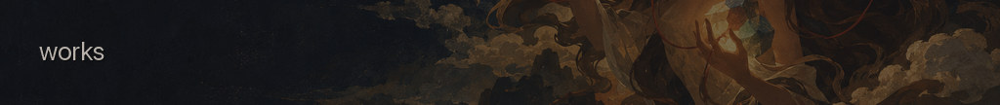
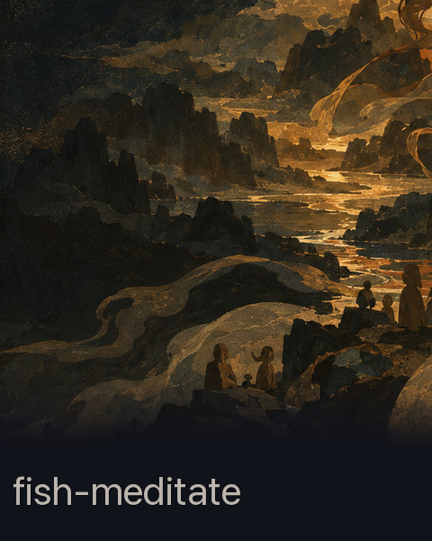
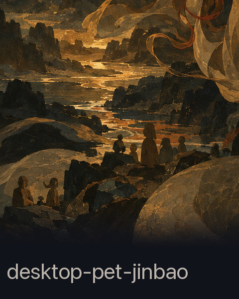
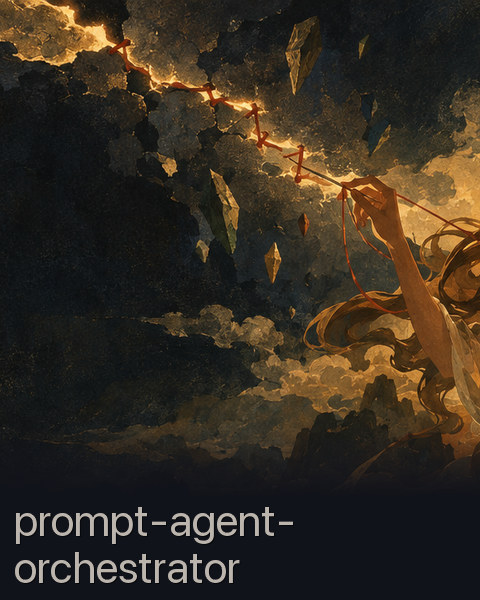
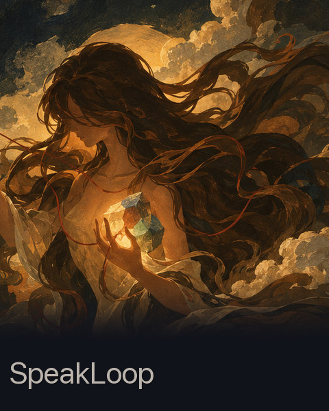
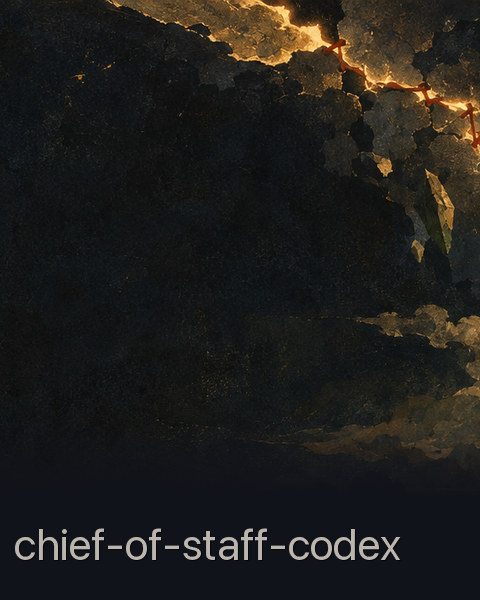
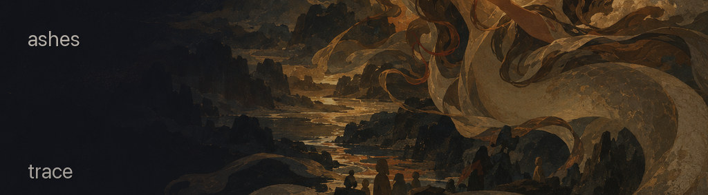

<picture>
  <source media="(prefers-reduced-motion: reduce) and (max-width: 768px)" srcset="assets/hero-mobile.jpg">
  <source media="(prefers-reduced-motion: reduce)" srcset="assets/hero.jpg">
  <source media="(max-width: 768px)" srcset="assets/hero-mobile-motion.gif">
  
</picture>

<!-- EDITABLE: The dark field at left intentionally stays open. Add at most one short line. -->

<picture>
  <source media="(max-width: 768px)" srcset="assets/works-mobile.jpg">
  
</picture>

<!-- EDITABLE: fish-meditate remains a visual-only slot until a public repository exists. -->

<picture>
  <source media="(max-width: 768px)" srcset="assets/ashes-trace-mobile.jpg">
  
</picture>

[GitHub ↗](https://github.com/rong2qi) · [repositories ↗](https://github.com/rong2qi?tab=repositories)

<!-- EDITABLE: Add a short trace link above if needed. Keep the writing field quiet. -->
