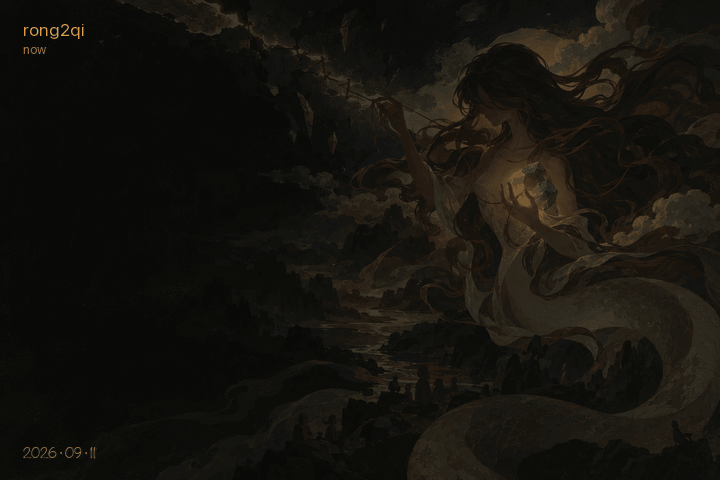
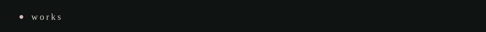
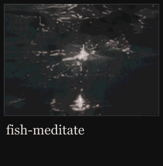
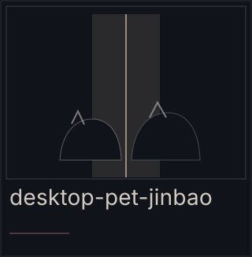
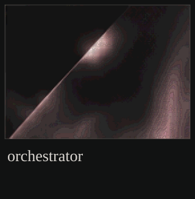
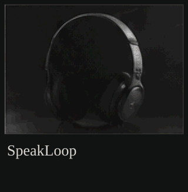
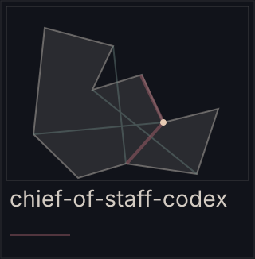
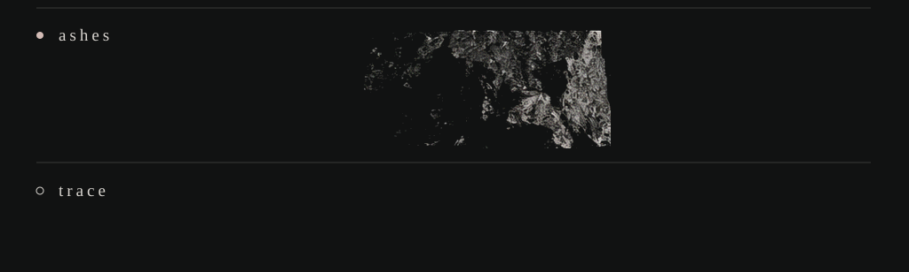

<picture>
  <source media="(prefers-reduced-motion: reduce) and (max-width: 1024px)" srcset="assets/hero-mobile.svg">
  <source media="(prefers-reduced-motion: reduce)" srcset="assets/hero.svg">
  <source media="(max-width: 1024px)" srcset="assets/hero-mobile-motion.gif">
  
</picture>

<!-- EDITABLE: The hero intentionally holds open negative space. Add only a short line here if you need one. -->

<picture>
  <source media="(max-width: 1024px)" srcset="assets/works-divider-mobile.svg">
  
</picture>

<picture><source media="(prefers-reduced-motion: reduce)" srcset="assets/work-fish.svg"></picture>

<!-- EDITABLE: fish-meditate is intentionally a visual-only slot until a public repository exists. -->

<picture>
  <source media="(max-width: 1024px)" srcset="assets/ashes-trace-mobile.svg">
  
</picture>

[GitHub ↗](https://github.com/rong2qi) · [repositories ↗](https://github.com/rong2qi?tab=repositories)

<!-- EDITABLE: Add a short project row or a trace link above. Keep the visual field quiet. -->
