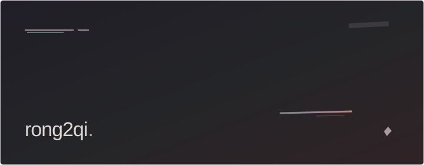
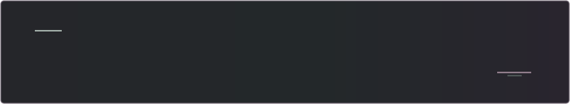

<picture>
  <source media="(prefers-color-scheme: dark)" srcset="assets/entry-dark.svg">
  <source media="(prefers-color-scheme: light)" srcset="assets/entry-light.svg">
  
</picture>

<!-- YOUR WORDS: Add your introduction here. Blank on purpose. -->

 

<picture>
  <source media="(prefers-color-scheme: dark)" srcset="assets/space-dark.svg">
  <source media="(prefers-color-scheme: light)" srcset="assets/space-light.svg">
  
</picture>

<!-- YOUR WORDS: Replace the empty panel above with writing or project links whenever you like. -->

[repos ↗](https://github.com/rong2qi?tab=repositories)
